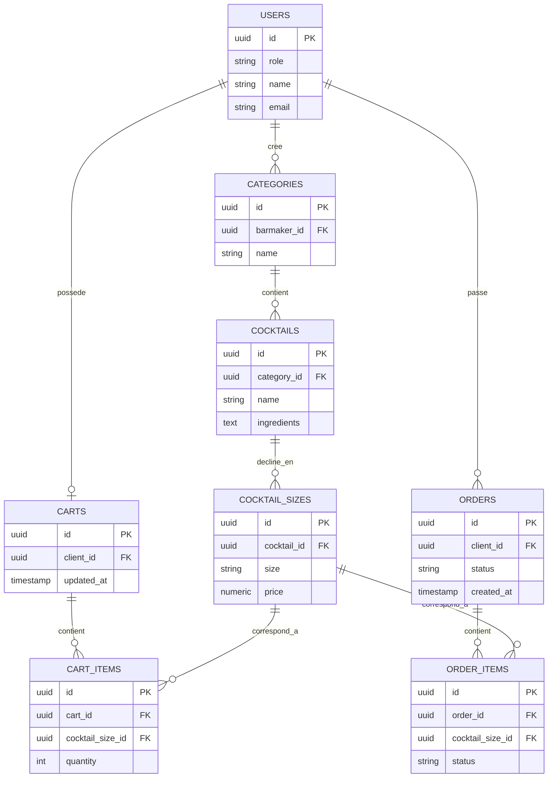

# BarApp

Schméma de la BDD : 

# Schéma de base de données - Application de commande de cocktails

## Diagramme entité-relation

## Description des tables

### USERS
Centralise les deux types d'utilisateurs (`role` = `client` ou `barmaker`).

### CATEGORIES
Catégories de la carte, créées par un barmaker.

### COCKTAILS
Un cocktail appartient à une catégorie et liste ses ingrédients.

### COCKTAIL_SIZES
Déclinaisons de taille (S, M, L) d'un cocktail, chacune avec son propre prix.

### CARTS
Panier actif d'un client. Un client a au plus un panier (contrainte `UNIQUE` sur `client_id`).

### CART_ITEMS
Lignes du panier, référençant une taille de cocktail précise et une quantité.

### ORDERS
Commande passée par un client. Statut global : `commandee`, `en_cours_de_preparation`, `terminee`.

### ORDER_ITEMS
Lignes d'une commande. Chaque ligne suit son propre avancement :
`preparation_ingredients` → `assemblage` → `dressage` → `terminee`.

## Règles de gestion

- Le statut global d'une commande passe automatiquement à `terminee` lorsque tous ses `order_items` sont à `terminee` (géré par trigger côté PostgreSQL).
- Le passage du panier à la commande copie les `cart_items` en `order_items`, puis vide le panier (fonction `checkout_cart`).
